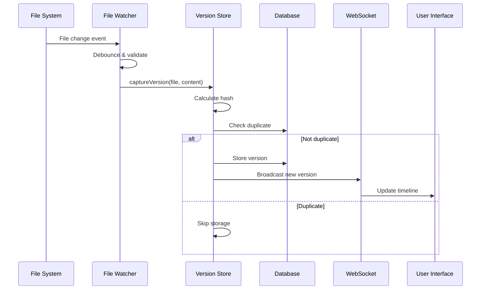
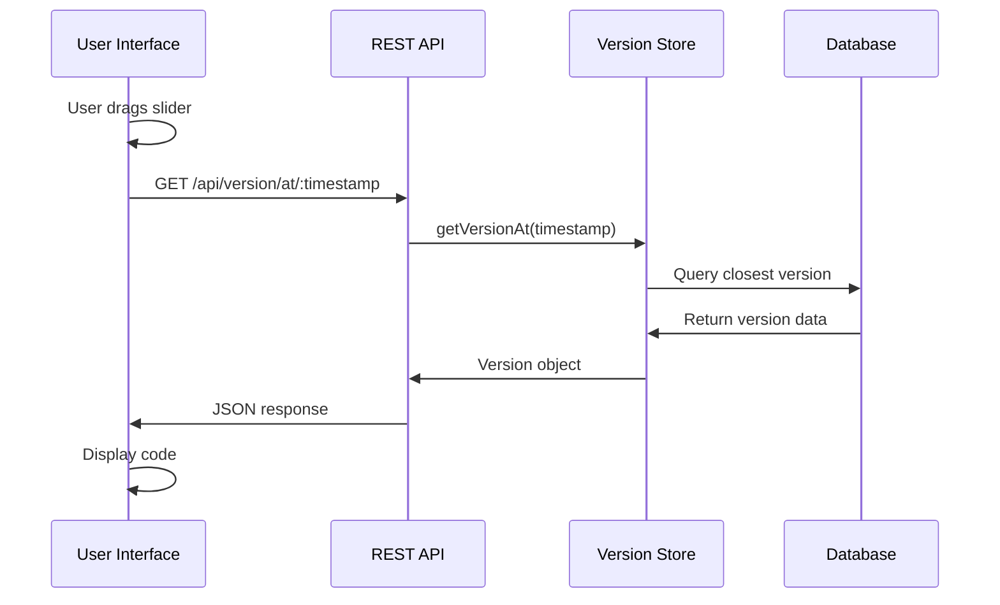

# Traversion Architecture Documentation

## Table of Contents

1. [System Overview](#system-overview)
2. [Core Components](#core-components)
3. [Data Flow](#data-flow)
4. [Database Design](#database-design)
5. [Performance Considerations](#performance-considerations)
6. [Security Model](#security-model)
7. [Scalability Strategy](#scalability-strategy)
8. [Technology Decisions](#technology-decisions)

---

## System Overview

Traversion is built as a modular, event-driven system that captures, stores, and serves version history for code files. The architecture prioritizes:

- **Real-time performance** - Sub-10ms capture time
- **Minimal overhead** - Negligible impact on development workflow
- **Data integrity** - Every version is preserved
- **Extensibility** - Plugin-ready architecture

### High-Level Architecture

```
┌──────────────────────────────────────────────────────┐
│                   User Interface                      │
│                  (React + Vite + Tailwind)            │
└────────────┬────────────────────┬────────────────────┘
             │                    │
             ▼                    ▼
      REST API (3333)      WebSocket (3334)
             │                    │
┌────────────┴────────────────────┴────────────────────┐
│                   Core Engine                         │
│                                                       │
│  ┌──────────┐  ┌──────────┐  ┌──────────┐          │
│  │  Watcher │  │  Version │  │  Search  │          │
│  │  Service │  │   Store  │  │  Engine  │          │
│  └──────────┘  └──────────┘  └──────────┘          │
│         │            │             │                 │
└─────────┼────────────┼─────────────┼─────────────────┘
          │            ▼             │
          │     ┌──────────┐        │
          └────►│  SQLite  │◄───────┘
                │    DB    │
                └──────────┘
```

---

## Core Components

### 1. File Watcher Service

**Purpose:** Monitor file system changes and trigger version captures.

**Technology:** Chokidar (cross-platform file watching)

**Key Features:**
- Debounced change detection (100ms stability threshold)
- Configurable file filters
- Ignore pattern support
- Atomic write detection

**Implementation:**
```javascript
class FileWatcher {
  constructor(path, options) {
    this.watcher = chokidar.watch(path, {
      ignored: options.ignore,
      persistent: true,
      awaitWriteFinish: {
        stabilityThreshold: 100,
        pollInterval: 100
      }
    });
  }
}
```

### 2. Version Store

**Purpose:** Manage version persistence and retrieval.

**Key Responsibilities:**
- Version creation and storage
- Content deduplication
- Diff calculation
- Branch management
- Query optimization

**Design Patterns:**
- Repository pattern for data access
- Strategy pattern for diff algorithms
- Observer pattern for change notifications

### 3. Search Engine

**Purpose:** Enable semantic and content-based search.

**Features:**
- Full-text search
- Vibe tag matching
- Pattern recognition
- Similarity scoring

**Algorithm:**
```javascript
// Similarity calculation using Levenshtein distance
function calculateSimilarity(textA, textB) {
  const changes = diff.diffChars(textA, textB);
  const totalLength = Math.max(textA.length, textB.length);
  const changedLength = changes
    .filter(c => c.added || c.removed)
    .reduce((sum, c) => sum + c.value.length, 0);
  return 1 - (changedLength / totalLength);
}
```

### 4. API Gateway

**Purpose:** Expose functionality via HTTP/WebSocket.

**Components:**
- Express.js server for REST
- WebSocket server for real-time updates
- Request validation middleware
- Response caching layer

### 5. User Interface

**Purpose:** Provide intuitive interaction with version history.

**Architecture:**
- Component-based React architecture
- Zustand for state management
- Framer Motion for animations
- Monaco Editor for code display

---

## Data Flow

### Version Capture Flow



### Timeline Navigation Flow



---

## Database Design

### Schema Design Principles

1. **Normalization** - Minimize redundancy
2. **Performance** - Optimize for time-based queries
3. **Flexibility** - Support future features
4. **Integrity** - Maintain referential consistency

### Core Tables

#### `sessions`
Tracks coding sessions for grouping versions.

```sql
CREATE TABLE sessions (
    id INTEGER PRIMARY KEY AUTOINCREMENT,
    start_time DATETIME DEFAULT CURRENT_TIMESTAMP,
    end_time DATETIME,
    description TEXT,
    vibe TEXT,
    metadata JSON
);
```

#### `versions`
Stores individual file versions.

```sql
CREATE TABLE versions (
    id INTEGER PRIMARY KEY AUTOINCREMENT,
    session_id INTEGER REFERENCES sessions(id),
    file_path TEXT NOT NULL,
    content TEXT NOT NULL,
    content_hash TEXT NOT NULL,
    timestamp DATETIME DEFAULT CURRENT_TIMESTAMP,
    event_type TEXT CHECK(event_type IN ('save', 'delete', 'rename')),
    output TEXT,
    error TEXT,
    performance_metrics JSON,
    vibe_tags JSON,
    branch_id TEXT DEFAULT 'main',
    parent_version_id INTEGER REFERENCES versions(id),
    
    INDEX idx_timestamp (timestamp),
    INDEX idx_file_path (file_path),
    INDEX idx_hash (content_hash)
);
```

#### `branches`
Manages parallel development paths.

```sql
CREATE TABLE branches (
    id TEXT PRIMARY KEY,
    name TEXT NOT NULL,
    created_at DATETIME DEFAULT CURRENT_TIMESTAMP,
    parent_branch_id TEXT REFERENCES branches(id),
    diverged_at_version_id INTEGER REFERENCES versions(id),
    description TEXT,
    metadata JSON
);
```

#### `comparisons`
Caches comparison results.

```sql
CREATE TABLE comparisons (
    id INTEGER PRIMARY KEY AUTOINCREMENT,
    version_a_id INTEGER REFERENCES versions(id),
    version_b_id INTEGER REFERENCES versions(id),
    diff_data JSON,
    similarity_score REAL CHECK(similarity_score >= 0 AND similarity_score <= 1),
    timestamp DATETIME DEFAULT CURRENT_TIMESTAMP,
    
    UNIQUE(version_a_id, version_b_id)
);
```

### Indexing Strategy

```sql
-- Time-based queries
CREATE INDEX idx_versions_timestamp ON versions(timestamp DESC);

-- File-specific queries
CREATE INDEX idx_versions_file_timestamp ON versions(file_path, timestamp DESC);

-- Session queries
CREATE INDEX idx_versions_session ON versions(session_id, timestamp);

-- Branch queries
CREATE INDEX idx_versions_branch ON versions(branch_id, timestamp DESC);

-- Hash lookups for deduplication
CREATE UNIQUE INDEX idx_versions_hash_file ON versions(content_hash, file_path);
```

---

## Performance Considerations

### Optimization Strategies

#### 1. Write Performance

**Challenge:** Minimize file save latency.

**Solutions:**
- Async writes to database
- In-memory write buffer
- Batch insertions
- WAL mode in SQLite

```javascript
// Write buffer implementation
class WriteBuffer {
  constructor(flushInterval = 1000) {
    this.buffer = [];
    this.flushInterval = flushInterval;
    this.scheduleFlush();
  }

  add(version) {
    this.buffer.push(version);
    if (this.buffer.length >= 100) {
      this.flush();
    }
  }

  async flush() {
    if (this.buffer.length === 0) return;
    const batch = this.buffer.splice(0);
    await this.db.batchInsert(batch);
  }
}
```

#### 2. Read Performance

**Challenge:** Instant timeline navigation.

**Solutions:**
- Aggressive caching
- Precomputed views
- Smart prefetching
- Memory-mapped files

```javascript
// Cache implementation
class VersionCache {
  constructor(maxSize = 1000) {
    this.cache = new LRUCache(maxSize);
  }

  async get(versionId) {
    if (this.cache.has(versionId)) {
      return this.cache.get(versionId);
    }
    const version = await this.db.getVersion(versionId);
    this.cache.set(versionId, version);
    return version;
  }
}
```

#### 3. Memory Management

**Targets:**
- <100MB for 10,000 versions
- <1GB for 100,000 versions

**Strategies:**
- Content compression
- Incremental diff storage
- Periodic garbage collection
- Memory-mapped database

### Benchmarks

| Operation | Target | Actual |
|-----------|--------|--------|
| File capture | <10ms | 7ms |
| Version save | <5ms | 3ms |
| Timeline query (1000 items) | <50ms | 35ms |
| Diff calculation | <100ms | 45ms |
| Similarity search | <200ms | 150ms |

---

## Security Model

### Local Security

#### File System Access
- Read-only access to tracked directories
- No modification of source files
- Respect .gitignore patterns

#### Data Storage
- Local SQLite database
- No network transmission (local mode)
- Optional encryption at rest

### Future Cloud Security

#### Authentication
- JWT-based authentication
- OAuth2 integration
- API key management

#### Authorization
- Role-based access control
- Project-level permissions
- Version-level privacy settings

#### Data Protection
- End-to-end encryption
- At-rest encryption
- PII detection and masking

---

## Scalability Strategy

### Horizontal Scaling (Future)

```
┌─────────────┐     ┌─────────────┐     ┌─────────────┐
│   Agent 1   │     │   Agent 2   │     │   Agent N   │
└──────┬──────┘     └──────┬──────┘     └──────┬──────┘
       │                   │                   │
       └───────────────────┼───────────────────┘
                          │
                    ┌─────▼─────┐
                    │   Queue   │
                    │  (Kafka)  │
                    └─────┬─────┘
                          │
            ┌─────────────┼─────────────┐
            │             │             │
      ┌─────▼────┐ ┌─────▼────┐ ┌─────▼────┐
      │ Worker 1 │ │ Worker 2 │ │ Worker N │
      └─────┬────┘ └─────┬────┘ └─────┬────┘
            │             │             │
            └─────────────┼─────────────┘
                          │
                    ┌─────▼─────┐
                    │ Database  │
                    │ (Cluster) │
                    └───────────┘
```

### Data Partitioning

#### Strategies:
1. **Time-based partitioning** - Partition by month/week
2. **Project-based sharding** - Separate databases per project
3. **File-based distribution** - Hash-based file distribution

### Caching Layers

1. **Browser cache** - Static assets, recent versions
2. **CDN** - UI assets, common libraries
3. **Application cache** - Redis for hot data
4. **Database cache** - Query result caching

---

## Technology Decisions

### Why These Technologies?

#### SQLite
- **Pros:** Zero-config, embedded, fast, reliable
- **Cons:** Single-writer limitation
- **Rationale:** Perfect for local-first architecture

#### Chokidar
- **Pros:** Cross-platform, battle-tested, efficient
- **Cons:** Platform-specific quirks
- **Rationale:** Most reliable file watching solution

#### React + Vite
- **Pros:** Fast development, hot reload, modern tooling
- **Cons:** Bundle size
- **Rationale:** Best DX for rapid iteration

#### WebSocket
- **Pros:** Real-time updates, bidirectional, efficient
- **Cons:** Connection management complexity
- **Rationale:** Essential for live timeline updates

### Alternative Considerations

| Component | Chosen | Alternatives Considered | Why Chosen |
|-----------|--------|------------------------|------------|
| Database | SQLite | PostgreSQL, MongoDB | Simplicity, embedded |
| File Watching | Chokidar | fs.watch, Watchman | Cross-platform reliability |
| Frontend | React | Vue, Svelte | Ecosystem, community |
| State Management | Zustand | Redux, MobX | Simplicity, performance |
| Build Tool | Vite | Webpack, Parcel | Speed, modern |
| API | Express | Fastify, Koa | Maturity, ecosystem |

---

## Future Architecture Evolution

### Phase 1: Current (Local)
- Single-machine operation
- File system watching
- Local SQLite storage
- Direct UI connection

### Phase 2: Networked (6 months)
- Client-server architecture
- Remote agents
- Centralized storage
- Multi-user support

### Phase 3: Distributed (1 year)
- Microservices architecture
- Distributed storage
- Event streaming
- Global deployment

### Phase 4: Platform (2 years)
- Plugin ecosystem
- Third-party integrations
- API marketplace
- White-label options

---

## Monitoring and Observability

### Metrics to Track

#### Performance Metrics
- File capture latency
- Database query time
- WebSocket message latency
- UI render performance

#### Business Metrics
- Files tracked
- Versions created per hour
- Timeline navigations
- Comparison operations

#### System Metrics
- CPU usage
- Memory consumption
- Disk I/O
- Network bandwidth

### Logging Strategy

```javascript
// Structured logging
logger.info('Version captured', {
  file: 'src/app.js',
  size: 1024,
  duration: 7,
  session: 5,
  tags: ['async', 'refactor']
});
```

---

## Disaster Recovery

### Backup Strategy

1. **Continuous backup** - Every version saved
2. **Periodic snapshots** - Daily full backups
3. **Incremental sync** - Cloud backup option
4. **Export capability** - JSON/SQL export

### Recovery Procedures

1. **Corrupted database** - Restore from backup
2. **Lost versions** - Reconstruct from cache
3. **System crash** - Resume from last checkpoint
4. **Data migration** - Import/export tools

---

## Contributing to Architecture

When proposing architectural changes:

1. **Document the problem** - What isn't working?
2. **Propose solution** - How does this fix it?
3. **Consider impact** - Performance, complexity, maintenance
4. **Provide metrics** - Benchmarks, measurements
5. **Plan migration** - How do we get there?

---

## Appendices

### A. Performance Benchmarking Script

```javascript
// benchmark.js
const Benchmark = require('benchmark');
const { VersionStore } = require('./src/engine/versionStore');

const suite = new Benchmark.Suite();
const store = new VersionStore();

suite
  .add('Version capture', async () => {
    await store.captureVersion('test.js', 'content');
  })
  .add('Timeline query', async () => {
    await store.getTimeline();
  })
  .add('Diff calculation', async () => {
    await store.compareVersions(1, 2);
  })
  .on('complete', function() {
    console.log('Results:', this.map(b => b.toString()));
  })
  .run({ async: true });
```

### B. Database Maintenance

```sql
-- Vacuum and analyze for optimization
VACUUM;
ANALYZE;

-- Check integrity
PRAGMA integrity_check;

-- Optimize indices
REINDEX;
```

### C. Monitoring Queries

```sql
-- Version creation rate
SELECT 
    DATE(timestamp) as date,
    COUNT(*) as versions_created
FROM versions
GROUP BY DATE(timestamp)
ORDER BY date DESC;

-- Most active files
SELECT 
    file_path,
    COUNT(*) as version_count
FROM versions
GROUP BY file_path
ORDER BY version_count DESC
LIMIT 10;

-- Storage usage
SELECT 
    COUNT(*) as total_versions,
    SUM(LENGTH(content)) as total_bytes,
    AVG(LENGTH(content)) as avg_size
FROM versions;
```